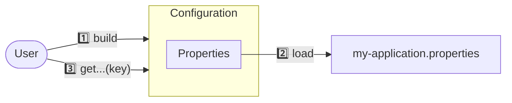
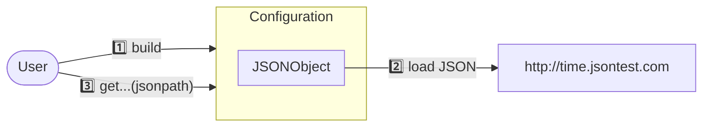

[](https://github.com/oswaldobapvicjr/confectory/graphs/contributors)
[](https://github.com/oswaldobapvicjr/confectory/actions/workflows/maven.yml)
[](https://codecov.io/gh/oswaldobapvicjr/confectory)
[](https://opensource.org/licenses/Apache-2.0)
[](https://maven-badges.herokuapp.com/maven-central/net.obvj/confectory-core)
[](https://javadoc.io/doc/net.obvj/confectory-core)


The modular, multi-format configuration framework for Java applications.

---

## Overview

**Confectory** is a modular framework designed to hide the complexity of handling multiple configuration files for Java applications in general, providing a **reliable** and **fast** API for parsing data from different **sources** (file or URL) in a variety of formats, and allowing data access using a **unified query language**.

````mermaid
flowchart TD
    User(["User"]) -->|"property"| c((("`**confectory**`"))):::larger
    User -->|"xpath"| c
    User -->|"jsonpath"| c

    c-->properties("properties"):::condensed
    c-->ini("INI"):::expanded
    c-->xml("XML"):::expanded
    c-->json("JSON"):::expanded
    c-->yaml("YAML"):::expanded
    c-->toml("TOML"):::expanded

    classDef larger font-size:18pt
    classDef condensed letter-spacing:-0.8px
    classDef expanded letter-spacing:1.2px
````

## Features

- Easy configuration setup via **intuitive API**
- Simple data query using **JSONPath**, **XPath**, or user-defined beans
- Support for the **best providers** available in the community (e.g.: Jackson, GSON)
- **Multiple configuration formats** (e.g.: XML, JSON, or YAML) with custom **precedence levels**
- **Lazy loading** of configuration sources


## Examples

### 1. Load data from a local Properties file in the classpath:



````java
Configuration<Properties> config = Configuration.<Properties>builder()
        .source("classpath://myapplication.properties")
        .mapper(new PropertiesMapper())
        .build();
````

Then access document data using one of the *getter* methods, using keys:
````java
System.out.println(config.getBoolean("web.enable"));
````


### 2. Load data from a JSON document in a Web server:



````java
Configuration<JSONObject> config = Configuration.<JSONObject>builder()
        .source("http://time.jsontest.com")
        .mapper(new JSONObjectMapper())
        .build();
````

Then access document data using [JSONPath expressions](https://goessner.net/articles/JsonPath/index.html#e2):
````java
System.out.println(config.getString("$.time"));
````

> ℹ️ [Find more examples in the wiki.](https://github.com/oswaldobapvicjr/confectory/wiki/Examples/)


## How to include it

Confectory was designed to work with the lowest-possible number of transitive dependencies. So, we offer separate modules that can be selected according to the client needs, optimizing your application:

| Module                                                                                                                                   | Providers         | Properties | XML     | JSON    | YAML    | TOML    |
|------------------------------------------------------------------------------------------------------------------------------------------|-------------------|:----------:|:-------:|:-------:|:-------:|:-------:|
| [**confectory-core**](https://maven-badges.herokuapp.com/maven-central/net.obvj/confectory-core)                                         | Java + json-smart | &#9745;    | &#9745; | &#9745; |         |         |
| [**confectory-datamapper-json-org**](https://maven-badges.herokuapp.com/maven-central/net.obvj/confectory-datamapper-json-org)           | Json.org          | &#9745;    | &#9745; | &#9745; |         |         |
| [**confectory-datamapper-gson**](https://maven-badges.herokuapp.com/maven-central/net.obvj/confectory-datamapper-gson)                   | Google Gson       |            |         | &#9745; |         |         |
| [**confectory-datamapper-jackson2-json**](https://maven-badges.herokuapp.com/maven-central/net.obvj/confectory-datamapper-jackson2-json) | Jackson 2         |            |         | &#9745; |         |         |
| [**confectory-datamapper-jackson2-toml**](https://maven-badges.herokuapp.com/maven-central/net.obvj/confectory-datamapper-jackson2-toml) | Jackson 2         |            |         | &#9745; |         | &#9745; |
| [**confectory-datamapper-jackson2-xml**](https://maven-badges.herokuapp.com/maven-central/net.obvj/confectory-datamapper-jackson2-xml)   | Jackson 2         |            | &#9745; | &#9745; |         |         |
| [**confectory-datamapper-jackson2-yaml**](https://maven-badges.herokuapp.com/maven-central/net.obvj/confectory-datamapper-jackson2-yaml) | Jackson 2         |            |         | &#9745; | &#9745; |         |
| [**confectory-datamapper-snakeyaml**](https://maven-badges.herokuapp.com/maven-central/net.obvj/confectory-datamapper-snakeyaml)         | SnakeYAML         |            |         | &#9745; | &#9745; |         |


## Contributing

If you want to contribute to the **Confectory** project, check the [issues](http://obvj.net/confectory/issues) page, or write an e-mail to [oswaldo@obvj.net](mailto:oswaldo@obvj.net).

**Confectory** uses [GitHub Actions](https://docs.github.com/actions) for CI/CD.

---

The Confectory logo and the file-factory animation were created with [Inkscape](http://www.inkscape.org) and [Natron](https://natrongithub.github.io), both **free and open-source** Software tools.
